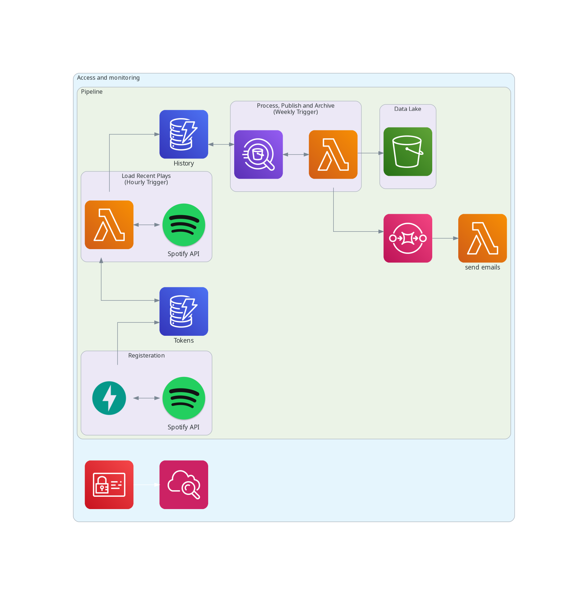
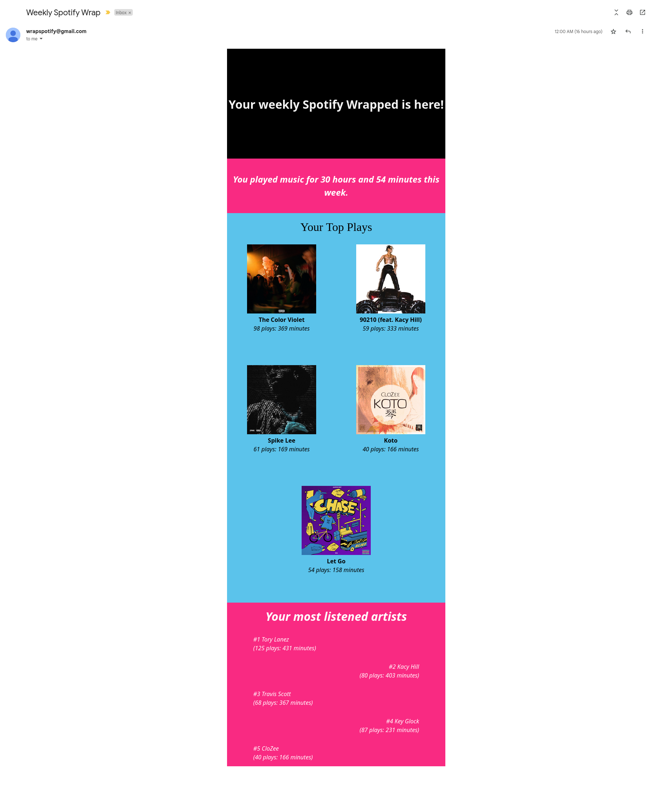

# mini-spotify-wrapped

## Introduction

This is a service that registers the user to a weekly email service that provides weekly content similar to Spotify Wrapped (most listened songs, genre, artists, total play time, etc.). 

## Workflow

The user registers using the API to grant the service permission to access some info about his account through Spotify's API. Registering through the API writes the user's email, and his tokens to a DynamoDB table called `tokens`; granting the service the right to send requests to the API on their behalf.

Then each hour, a Lambda function triggers and asks the API for the recent plays of each registerd user in the `tokens` table and writes the response to a DynamoDB table called `history`. 

Each week, a second Lambda function (written in Go) queries the `history` table for all recent plays for each user during the previous week, analyzes the plays and writes to a SQS queue which triggers a third Lambda function.

The third Lambda parses the messages from SQS and sends a formatted HTML/CSS email to each user with their listening summaries.

The second lambda was written in Go for concurrent execution of the queries, since the code will hang while waiting for athena to return the results. The Go code runs the queries, which also run concurrently, for all users concurrently. This means that the Go code is exponentially faster than the Python code. (3x faster for the current user count).

The tables, functions, and queue are created beforehand through the AWS console.

## diagram

## Email reportt

# Disclaimer
Due to Spotify API's restrictions, this service is not available publicly. Currently, this is only used by me and a few close friends.
